# UX sweep — 2026-10-03-us-centric-and-shapes-both

- Input mode: **both**
- Concepts probed: **12** (12 reviewed)
- ✅ 10 clean · 🎨 2 could improve · 🐞 0 bug

Each question screenshot is the exact screen the player sees. The wrong-answer screenshot is that same question, replayed from its seed and answered with a distractor.

**One wrong-answer screenshot covers both input modes.** The band never reaches the result screen — it renders from the question, the submitted answer and the outcome, and in debug mode bricks are always 0 and the unlock event null. Same seed → same question → same distractor → same red screen. _keypad → MC_ in the keypad column means the question forced multiple choice (`multipleChoiceOnly`, or a text-shaped answer format), so that screen is the MC one.

The green "Correct!" screen is verified programmatically and not captured — it is identical for every concept.

<!-- OBSERVATIONS: hand-written, preserved across rebuilds -->
## Observations

_Nothing yet. Type notes between the two `OBSERVATIONS` HTML comments and
they survive every rebuild — everything outside them is regenerated._
<!-- END OBSERVATIONS -->

## Findings

| | Concept | Finding |
|---|---|---|
| 🎨 | [Integers on number line](#integers_on_number_line) `integers_on_number_line` | Works as intended (only 0 and 25 labelled, point at −75, counted not read). The number-line tick labels are small (~11 px) for a whole-screen diagram; a larger label font would help — pre-existing to the NumberLine widget. |
| 🎨 | [Sales tax and tip](#sales_tax_tip) `sales_tax_tip` | Question now says "service charge"; the concept name in the title bar still reads "Sales tax and tip". Fixed in the same session: renamed "Tax and service charge". |

## 3.6 Decimals & Percentages (`decimals_percent`)

| | Concept | Question (MC) | Question (keypad) | Wrong answer | Notes |
|---|---|---|---|---|---|
| ✅ | **Round decimals** `round_decimals` G5 · dataset | 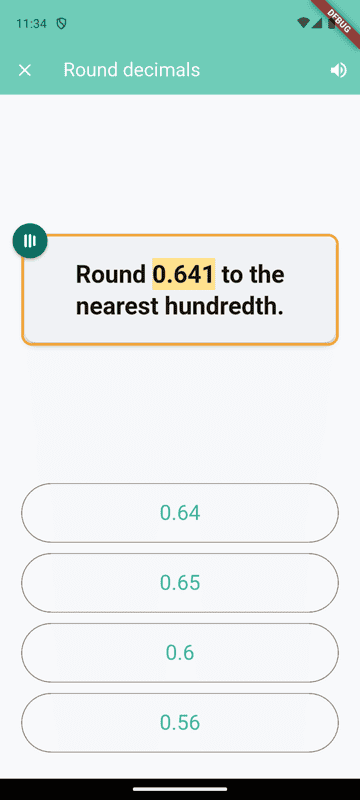 | 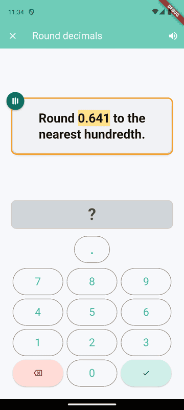 | 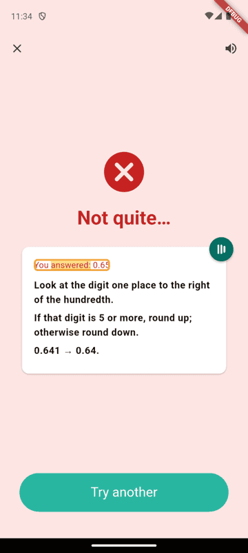 | Generator sample; the 200 dataset items now read "to the nearest tenth/hundredth/thousandth" too (checked in the JSON, not on screen). |
| 🎨 | **Sales tax and tip** `sales_tax_tip` G7 | 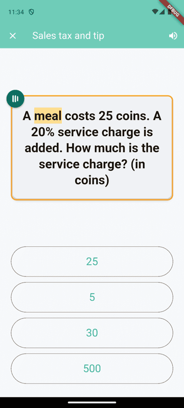 | 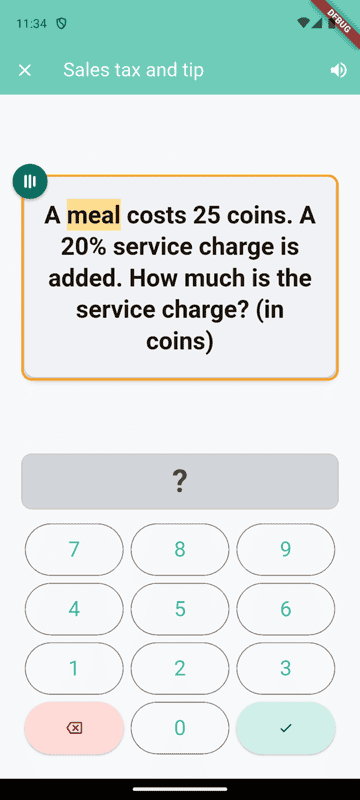 | 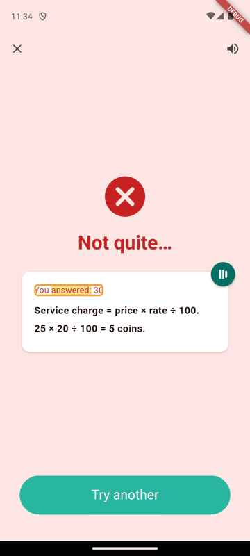 | Question now says "service charge"; the concept name in the title bar still reads "Sales tax and tip". Fixed in the same session: renamed "Tax and service charge". |

## 3.7 Ratios & Proportions (`ratios`)

| | Concept | Question (MC) | Question (keypad) | Wrong answer | Notes |
|---|---|---|---|---|---|
| ✅ | **Ratio tables** `ratio_table` G6 · TapeDiagramSpec | 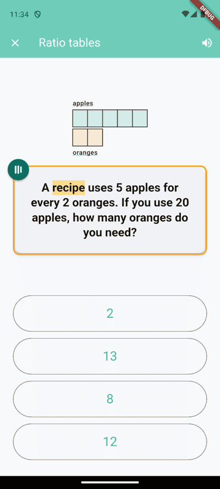 | 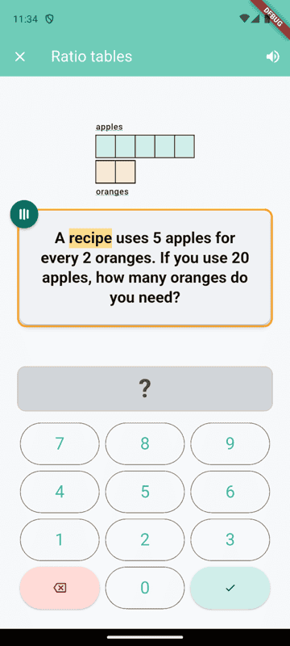 | 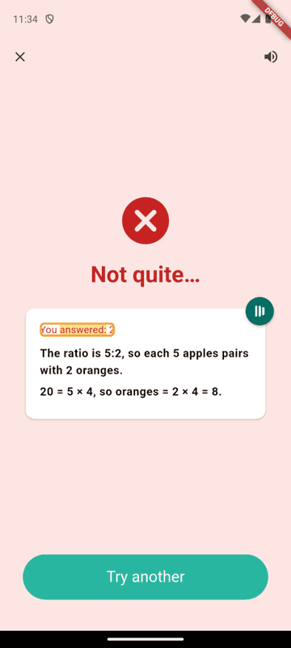 |  |
| ✅ | **Scale drawings** `scale_drawing` G7 | 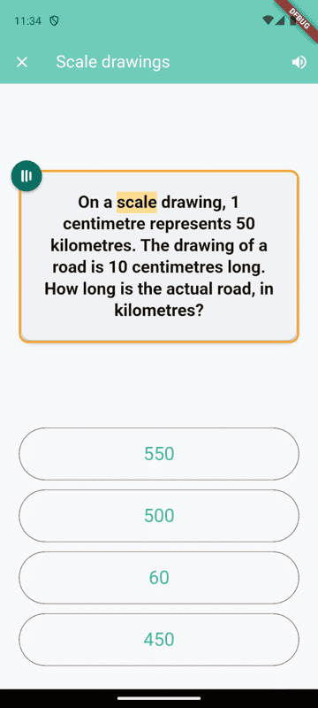 | 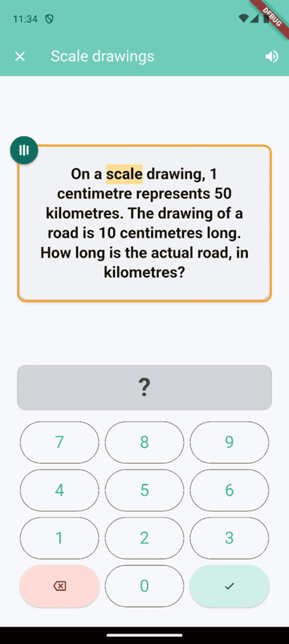 | 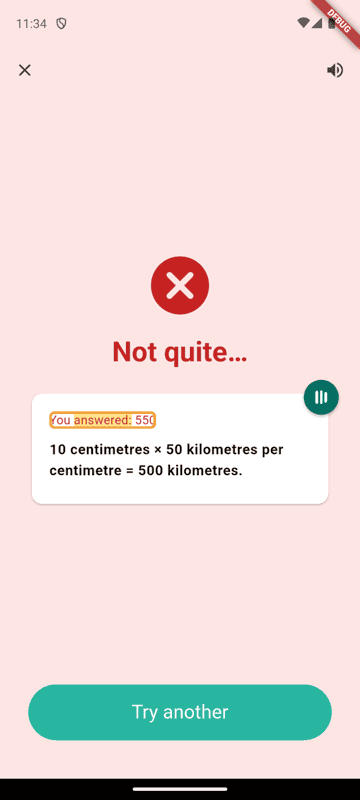 |  |

## 3.8 Measurement, Time & Money (`measurement`)

| | Concept | Question (MC) | Question (keypad) | Wrong answer | Notes |
|---|---|---|---|---|---|
| ✅ | **Estimate length** `estimate_length` G2 | 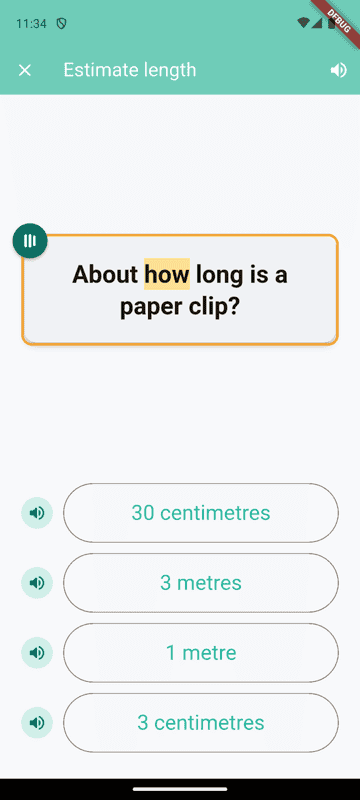 | _keypad → MC_ | 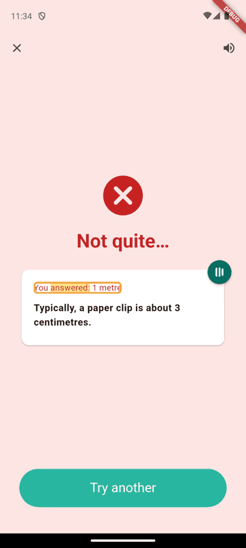 |  |
| ✅ | **Measure to ½ cm** `measure_to_half_cm` G3 · RulerSpec | 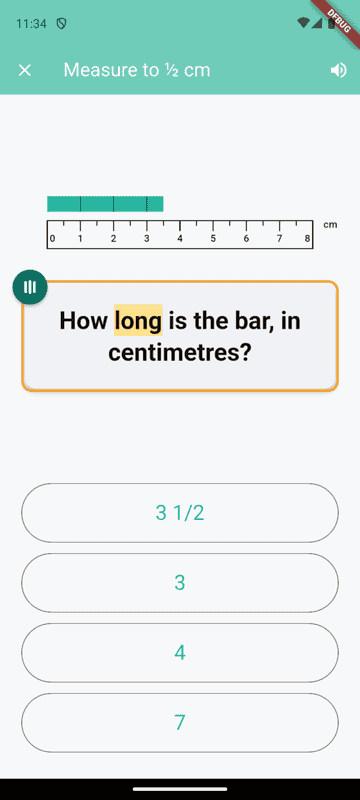 | 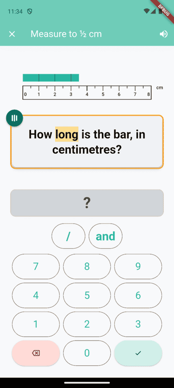 | 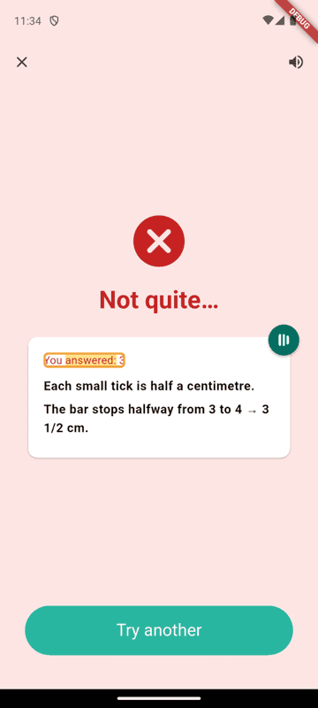 |  |
| ✅ | **Convert units (one system)** `convert_units_within_system` G4 | 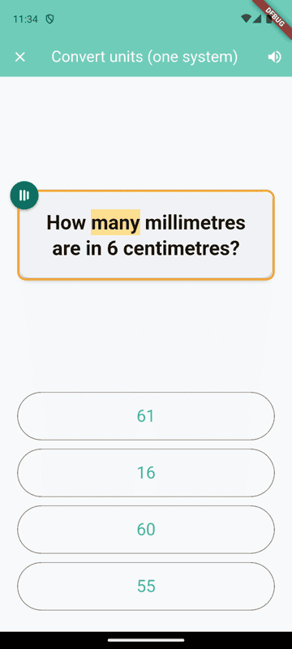 | 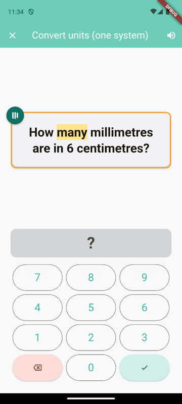 |  |  |

## 3.9 Geometry & Shapes (`geometry`)

| | Concept | Question (MC) | Question (keypad) | Wrong answer | Notes |
|---|---|---|---|---|---|
| ✅ | **Build shapes from shapes** `compose_shapes` G1 · ShapeSpec | 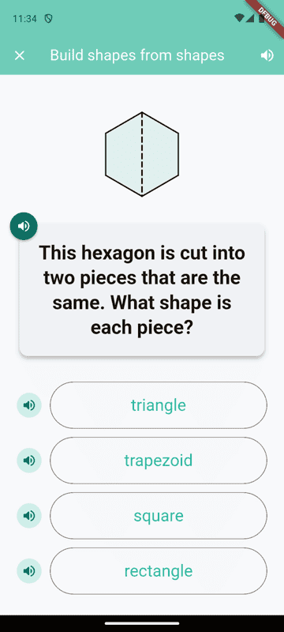 | _keypad → MC_ | 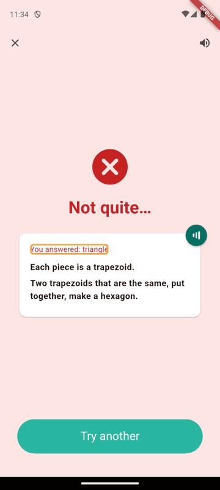 |  |

## 3.10 Integers & Rational Numbers (`rationals`)

| | Concept | Question (MC) | Question (keypad) | Wrong answer | Notes |
|---|---|---|---|---|---|
| 🎨 | **Integers on number line** `integers_on_number_line` G6 · NumberLineSpec | 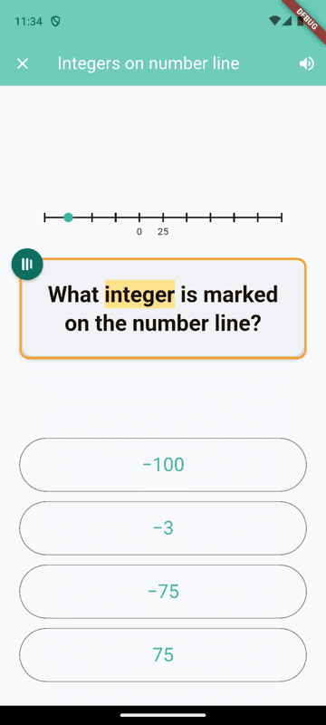 | 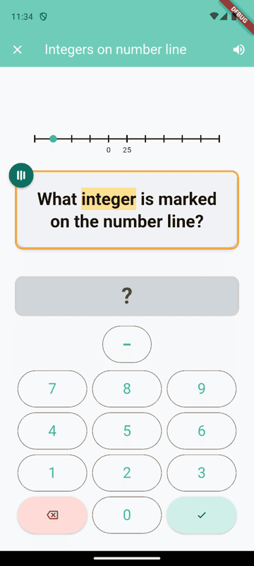 | 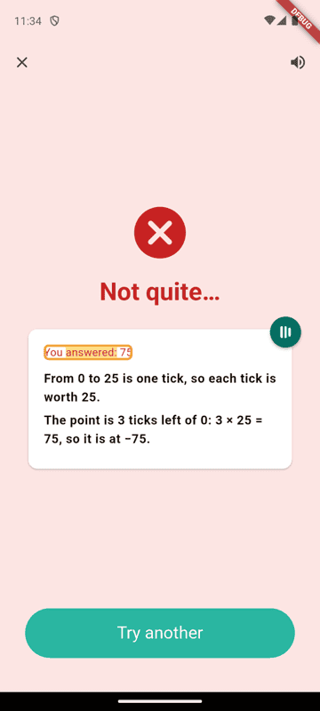 | Works as intended (only 0 and 25 labelled, point at −75, counted not read). The number-line tick labels are small (~11 px) for a whole-screen diagram; a larger label font would help — pre-existing to the NumberLine widget. |

## 3.12 Data, Statistics & Probability (`stats`)

| | Concept | Question (MC) | Question (keypad) | Wrong answer | Notes |
|---|---|---|---|---|---|
| ✅ | **Line plot (½, ¼, ⅛)** `line_plot_fractional` G4 · DotPlotSpec | 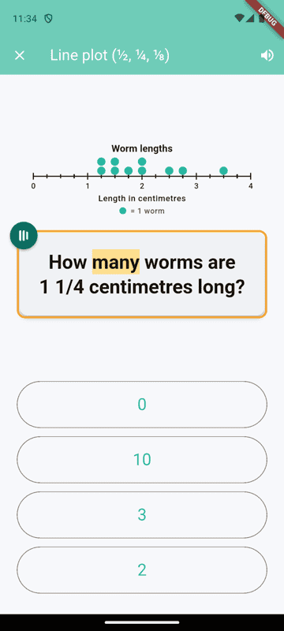 | 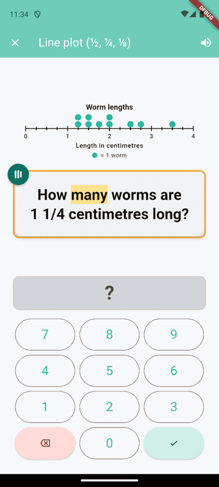 |  |  |
| ✅ | **Histogram** `histogram` G6 · HistogramSpec | 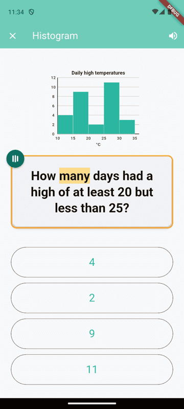 | 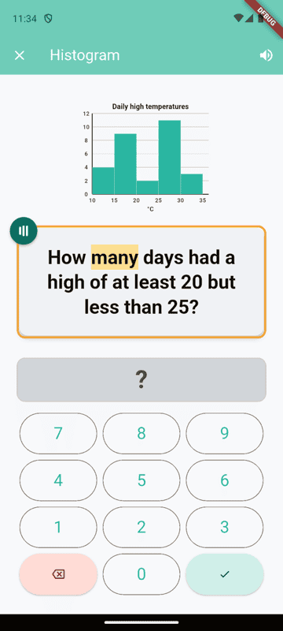 | 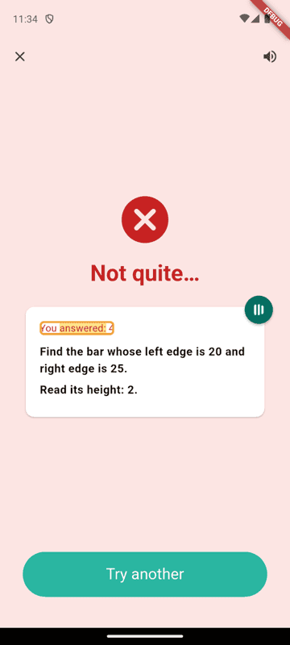 |  |
| ✅ | **Box plot** `box_plot` G6 · BoxPlotSpec | 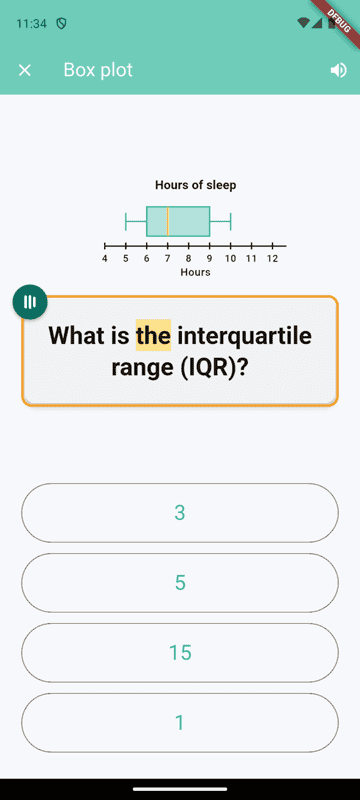 | 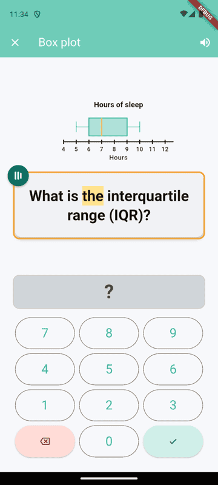 | 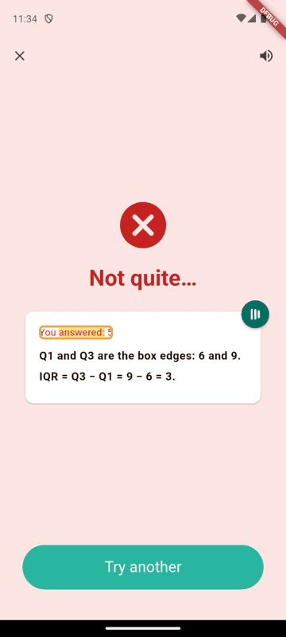 |  |

